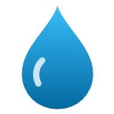

<p align="center">
  
</p>

<h1 align="center">Sip — Water Log</h1>

<p align="center">
  A keyboard-first browser extension for keeping a record of every glass of water you drink.<br>
  Press a shortcut, and the glass is logged with a timestamp. At the end of the day, open a full breakdown.
</p>

<p align="center">
  
  
  
  <a href="LICENSE"></a>
</p>

---

Sip is a **record, not a reminder**. It never nags you. It just makes logging a glass take one keypress, so you actually do it.

## Features

- **One-key logging.** Log a glass from any tab without opening anything, and the toolbar badge shows today's count.
- **Fully customizable shortcuts** on three levels:
  - Browser-level shortcuts that work on every tab.
  - In-page shortcuts that can be any key, such as `Shift+/`.
  - Keys inside the popup.
- **Glass presets** with your own names and sizes (for example Glass 250 ml, Bottle 500 ml). Press `1`–`9` in the popup to log a specific size.
- **Daily breakdown:**
  - A timestamped timeline with a running total and the gap since the previous glass.
  - Goal progress, first and last glass, and your longest gap.
- **Week and month charts** of daily totals, with a goal line.
- **Edit, delete, or add a glass after the fact**, for when you forgot to log one.
- **CSV export** for a date range or your whole history. It opens cleanly in Excel or Google Sheets.
- **ml or fl oz**, a daily goal, and a custom time for when your day starts. For example, if your day starts at 4 AM, a glass at 1 AM still counts toward the previous day.
- **Private.** Everything stays in your browser. There is no account, no server, no analytics, and no network requests.
- **Tiny and dependency-free.** It is written in plain HTML, CSS and JavaScript, with no build step.

## Quick start

1. [Download this repository](../../archive/refs/heads/main.zip) and unzip it, or run `git clone`.
2. Open your browser's extensions page, such as `chrome://extensions` or `edge://extensions`.
3. Turn on **Developer mode**.
4. Click **Load unpacked** and select the **`extension`** folder.

For step-by-step instructions for each browser, shortcut setup and troubleshooting, see the **[Setup guide](docs/SETUP.md)**.

## Default shortcuts

| Where it works | Default | Action |
|---|---|---|
| Anywhere in the browser | `Alt+Shift+W` | Open the Sip popup |
| Anywhere in the browser | `Alt+Shift+L` | Log your default glass without opening anything |
| Anywhere in the browser | `Alt+Shift+Z` | Undo the last glass |
| On web pages | `Shift+/` | Open the Sip popup |
| Inside the popup | `Enter` / `Space` | Log your default glass |
| Inside the popup | `1` – `9` | Log a specific glass size |
| Inside the popup | `Backspace` | Undo the last glass |
| Inside the popup | `R` / `O` | Open the report / settings |
| Report page | `←` `→` / `T` | Previous or next day / jump to today |

Every one of these can be changed. See [Customizing shortcuts](docs/SETUP.md#3-set-up-your-shortcuts).

> [!NOTE]
> Browsers sometimes skip the suggested browser-level shortcuts, for example when the key is already taken. If a shortcut shows **Not set**, assign it yourself. It takes 10 seconds, and the [setup guide](docs/SETUP.md#browser-shortcuts) shows how.

## Screenshots

| Browser shortcuts (Sip settings) | Browser's own shortcuts page (Edge) |
|---|---|
|  |  |

| In-page shortcuts | Popup keys |
|---|---|
|  |  |

## How the three kinds of shortcuts differ

| | Browser shortcuts | In-page shortcuts | Popup keys |
|---|---|---|---|
| Works on | Every tab, including new-tab and settings pages | Normal websites only | Inside the open popup |
| Allowed keys | Must include `Ctrl` or `Alt` | Anything, such as `Shift+/` | Anything except `1`–`9` |
| Changed in | The browser's shortcuts page | Sip settings | Sip settings |
| Notes | Can be set to **Global**, so it works even when the browser isn't focused | Ignored while you type in text fields; can be turned off per site | Several keys per action |

## Project structure

```
.
├── extension/              ← load this folder in your browser
│   ├── manifest.json       Manifest V3: commands, permissions, pages
│   ├── background.js       service worker: shortcuts, writes to the log, toolbar badge
│   ├── content.js          optional in-page shortcuts and the confirmation toast
│   ├── lib/
│   │   ├── store.js        settings (storage.sync) and log (storage.local, one key per day)
│   │   ├── time.js         day boundaries, formatting, unit conversion
│   │   ├── keys.js         turns key presses into combos like "Shift+/"
│   │   └── base.css        shared theme with light and dark mode
│   ├── pages/
│   │   ├── popup.*         quick-log panel
│   │   ├── report.*        daily breakdown, charts and CSV export
│   │   └── options.*       settings
│   └── icons/
└── docs/
    ├── SETUP.md            setup and troubleshooting guide
    └── images/             screenshots
```

## Data and privacy

- **Settings** are stored in `chrome.storage.sync`, so they follow you to other computers signed in to the same browser profile.
- **Your water log** is stored in `chrome.storage.local`, on this device only.
- **No network requests.** Sip asks for only two permissions:
  - `storage` to save your settings and log.
  - `alarms` to reset the badge when a new day starts.
- **Page access for in-page shortcuts.** The in-page shortcut script runs on web pages, but it only listens for your chosen keys and never reads page content.

To back up your data, use **Export everything** on the report page.

## Development

There is nothing to install or build. Edit the files in `extension/`, then click the reload icon on the Sip card at `chrome://extensions`. Reopen the popup or page to see your changes.

- The service worker's console is at `chrome://extensions` → Sip → **Inspect views: service worker**.
- To inspect the popup, right-click it and choose **Inspect**.
- JavaScript files use `// @ts-check` with JSDoc types, so VS Code flags type errors without a TypeScript build.

## Browser support

This works in any Chromium-based browser with Manifest V3 support:

- Chrome 116+
- Edge 116+
- Brave
- Opera
- Vivaldi
- Arc

Opening the popup from an in-page shortcut uses `chrome.action.openPopup()`, which needs Chromium 127 or later. Older versions open Sip in a small window instead.

Firefox and Safari are not supported.

## License

[Apache License 2.0](LICENSE)
