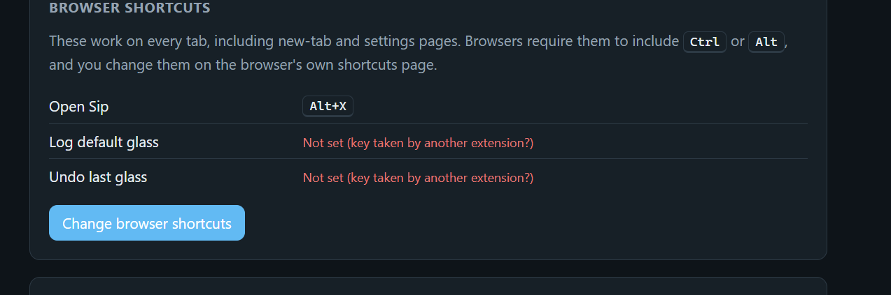
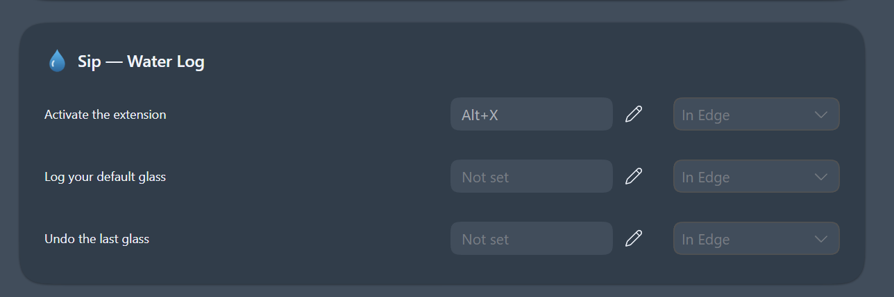
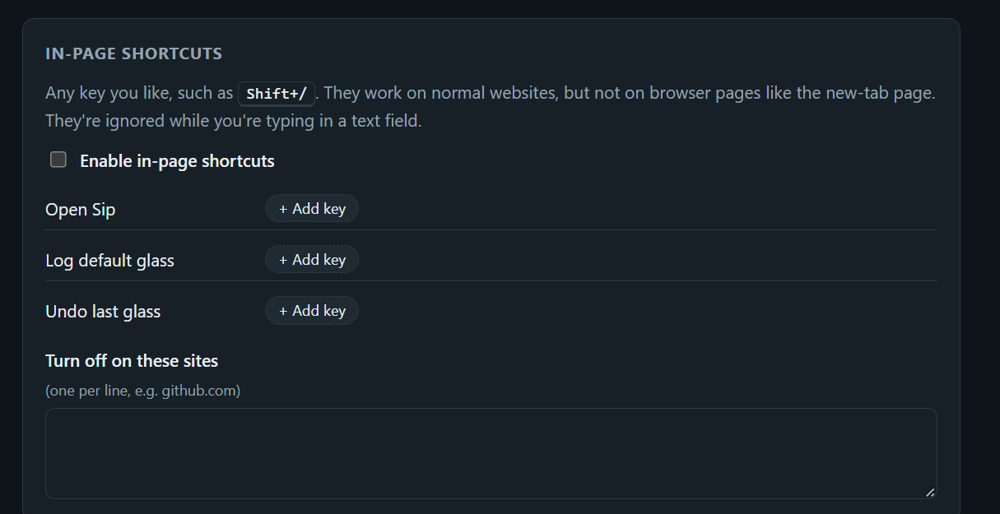
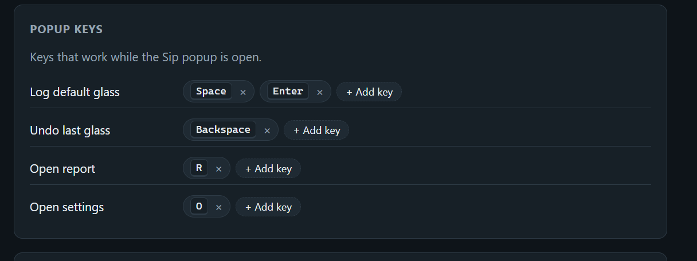

# Setup guide

This guide takes about 5 minutes and covers:

1. [Install the extension](#1-install-the-extension)
2. [Pin it to the toolbar](#2-pin-it-to-the-toolbar)
3. [Set up your shortcuts](#3-set-up-your-shortcuts)
4. [Set your glass sizes and goal](#4-set-your-glass-sizes-and-goal)
5. [Daily use](#5-daily-use)
6. [Updating](#6-updating)
7. [Troubleshooting](#troubleshooting)

---

## 1. Install the extension

Sip isn't in an extension store yet, so you load it as an "unpacked" extension. It's safe, and the browser just reads the files from a folder on your computer.

### Get the files

- **With Git:**
  ```bash
  git clone https://github.com/NayanPokharel03/Sip.git
  ```
- **Without Git:** on the GitHub page, click **Code → Download ZIP**, then unzip it somewhere permanent, such as `Documents\Sip`.

> [!IMPORTANT]
> Keep the folder where it is after installing. The browser loads Sip from that folder every time it starts. If you move or delete the folder, the extension stops working, and **your log is tied to that folder's location**. If you load Sip from a different folder, it starts with an empty log.

### Load it in your browser

| Browser | Extensions page |
|---|---|
| Chrome | `chrome://extensions` |
| Edge | `edge://extensions` |
| Brave | `brave://extensions` |
| Opera | `opera://extensions` |
| Vivaldi | `vivaldi://extensions` |

1. Type the address for your browser into the address bar and press Enter.
2. Turn on **Developer mode**. In Chrome and Brave the toggle is at the top right. In Edge it's in the left sidebar.
3. Click **Load unpacked**.
4. Select the **`extension`** folder inside the repository, the one that contains `manifest.json`. Don't select the top-level folder.

Sip's settings page opens automatically. Leave it open, because you'll use it in step 3.

> [!NOTE]
> Chrome may show a banner saying *"Disable developer mode extensions"* when it starts. Click the ✕ to dismiss it, and Sip keeps working.

## 2. Pin it to the toolbar

Click the puzzle-piece icon 🧩 in the toolbar, then the pin 📌 next to **Sip — Water Log**. The badge on the icon shows how many glasses you've logged today.

## 3. Set up your shortcuts

Sip has three kinds of shortcuts. You don't need all of them. Most people use one browser shortcut to log and the popup for everything else.

### Browser shortcuts

These work on **every tab**, including the new-tab page and browser settings, and they don't need the popup open.

In Sip's settings, the **Browser shortcuts** section shows what's currently assigned:



If any say **Not set**, the browser didn't accept the default key, usually because another extension or the browser itself already uses it. To fix it:

1. Click **Change browser shortcuts**. You can also open the page directly:
   - Chrome: `chrome://extensions/shortcuts`
   - Edge: `edge://extensions/shortcuts`
   - Brave: `brave://extensions/shortcuts`
   - Opera and Vivaldi: open the extensions page and look for **Keyboard shortcuts**.
2. Find **Sip — Water Log**.
3. Click the pencil ✏️ or the box next to an action, then press the keys you want.

   

| Action on the browser's page | What it does | Suggested keys |
|---|---|---|
| **Activate the extension** | Opens the Sip popup | `Alt+Shift+W` or `Alt+X` |
| **Log your default glass** | Logs one glass instantly | `Alt+Shift+L` |
| **Undo the last glass** | Removes the most recent glass | `Alt+Shift+Z` |

Some rules and tips:

- Shortcuts **must include `Ctrl` or `Alt`**, which is a browser rule. On macOS, `Cmd` also works.
- The dropdown next to each shortcut, labeled **In Edge**, **In Chrome** and so on, controls where it works:
  - **In [browser]** means only while the browser window is focused. This is the default.
  - **Global** means anywhere on your computer while the browser is running, even if you're in another app. Global shortcuts are limited to `Ctrl+Shift+0` – `Ctrl+Shift+9`.
- When you come back to Sip's settings tab, it updates to show your new keys.

### In-page shortcuts

These can be **any key you like**, including a single key with Shift, such as `Shift+/`. They're handy because they're fast to press, but they have limits:

- They only work on normal websites, not on the new-tab page, browser settings pages, the Chrome Web Store or PDFs.
- They're ignored while you're typing in a text box, so typing `?` in a search box won't log water.
- They take priority over the website's own shortcut for the same key. Add sites to **Turn off on these sites** when you need a site's own shortcut, such as `?` for keyboard help on GitHub or Gmail.



To set them up:

1. Tick **Enable in-page shortcuts**.
2. Click **+ Add key** next to an action and press the combination. Press `Esc` to cancel.
3. To remove a key, click the **×** on its chip.
4. Optionally, list sites where they should stay off, one per line, such as `github.com`. Subdomains are included, so `google.com` also covers `mail.google.com`.

When you log from a web page, a small confirmation appears in the bottom-right corner, for example *"+250 ml · 1.25 L of 2.5 L today"*.

> [!TIP]
> After installing or reloading Sip, **refresh any tabs that were already open** before in-page shortcuts will work on them.

### Popup keys

These work while the Sip popup is open. Each action can have several keys.



The number keys `1`–`9` are always reserved for logging a specific glass size. Size 1 is the first preset, size 2 the second, and so on.

A fast workflow is to open the popup with your browser shortcut, then press `Enter` for your usual glass or a number for a different size. Close the popup by pressing `Esc` or clicking elsewhere.

## 4. Set your glass sizes and goal

In Sip's settings:

- **Glass sizes:**
  - Rename sizes, change their amounts, or add sizes, up to 9.
  - The **Default** size is what your "log" shortcuts record.
- **Daily goal:** your target, 2.5 L by default. It sets the progress bar and the goal line on the chart.
- **Unit:** ml/L or fl oz. Your log is stored in ml, so switching units never changes your data.
- **A new day starts at:** the time your day resets, 4 AM by default. Glasses logged before this time count toward the previous day, which is useful if you stay up late.

Changes save automatically, and a green **Saved** confirmation appears next to the page title.

## 5. Daily use

- **Log a glass:** press your log shortcut. The badge count goes up and briefly flashes green.
- **Log by mistake?** Press your undo shortcut, or `Backspace` in the popup.
- **Forgot to log one?** Open the report, pick the day, and use the **Add** form. Set the time and amount, then click **Add**.
- **End of the day:** open the popup and press `R`, or click **Report**. You'll see:
  - Total, number of glasses, first and last glass, and the longest gap.
  - A timeline with each glass's time, amount, running total and the gap since the previous glass.
  - A week or month chart. Click a bar to jump to that day.
- **Export:** at the bottom of the report, choose a date range and click **Download CSV**, or click **Export everything**.

## 6. Updating

To get a new version:

1. Run `git pull`, or download the ZIP again and **replace the files in the same folder**.
2. Go to your browser's extensions page and click the reload icon ↻ on the Sip card.

Your log and settings are kept, as long as the folder stays in the same place.

## Troubleshooting

<details>
<summary><b>A browser shortcut says "Not set" or does nothing</b></summary>

The key is probably used by the browser or another extension. Assign a different one on the browser's shortcuts page, as described in [Browser shortcuts](#browser-shortcuts). Edge in particular often leaves the suggested keys unassigned.
</details>

<details>
<summary><b>In-page shortcut doesn't work</b></summary>

- Check that **Enable in-page shortcuts** is ticked and that a key is added.
- Refresh the tab. Tabs opened before you installed or reloaded Sip don't have the shortcut script yet.
- In-page shortcuts don't work on browser pages such as the new-tab page, `chrome://` or `edge://` pages, the extension store, or PDFs. Use a browser shortcut there instead.
- Check that the site isn't in **Turn off on these sites**.
- Make sure the cursor isn't in a text field.
</details>

<details>
<summary><b>The in-page shortcut opens a small window instead of the popup</b></summary>

Your browser is older than Chromium 127, which doesn't let extensions open their popup programmatically. Update the browser, or use the browser shortcut for **Activate the extension** instead.
</details>

<details>
<summary><b>The badge shows yesterday's count</b></summary>

The badge resets at the time set in **A new day starts at**, 4 AM by default. If you want it to reset at midnight, set that to **Midnight**.
</details>

<details>
<summary><b>My log is empty after I moved the folder</b></summary>

Unpacked extensions get an ID based on the folder's location, and the data is stored under that ID. Move the folder back to its original location and reload, and your log returns. **Export everything** to CSV before moving the folder again.
</details>

<details>
<summary><b>"Manifest file is missing or unreadable"</b></summary>

You selected the wrong folder. Select the **`extension`** folder, the one that directly contains `manifest.json`.
</details>
